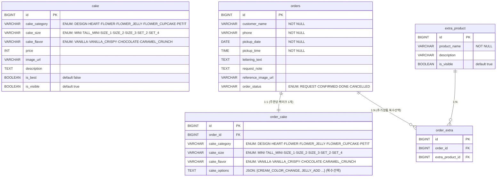

# OhMuseCake — ERD & Entity 관계 정리

## ERD (Mermaid)



---

## 테이블별 설명

### `cake` — 케이크 상품 목록
관리자가 등록하는 케이크 상품. 홈 화면 및 상품 상세에 사용.

| 컬럼 | 타입 | 설명 |
|------|------|------|
| id | BIGINT PK | 자동증가 |
| cake_category | VARCHAR | 케이크 종류 (ENUM) |
| cake_size | VARCHAR | 사이즈 (ENUM) |
| cake_flavor | VARCHAR | 시트 맛 (ENUM) |
| price | INT | 가격 |
| image_url | VARCHAR | 케이크 이미지 URL |
| description | TEXT | 케이크 설명 |
| is_best | BOOLEAN | 베스트 여부 |
| is_visible | BOOLEAN | 공개 여부 (품절/비공개 시 false) |

---

### `orders` — 주문서 (주문자 정보)
고객이 제출한 주문서의 기본 정보.

| 컬럼 | 타입 | 설명 |
|------|------|------|
| id | BIGINT PK | 자동증가 |
| customer_name | VARCHAR | 이름/입금자명 |
| phone | VARCHAR | 연락처 |
| pickup_date | DATE | 픽업 날짜 |
| pickup_time | TIME | 픽업 시간 |
| lettering_text | TEXT | 레터링 종류 + 문구 (예: 판 레터링 10~13글자\n생일축하해) |
| request_note | TEXT | 디자인 디테일 + 보냉백 선택 결과 (합산 저장) |
| reference_image_url | VARCHAR | 참고 이미지 URL |
| order_status | VARCHAR | 주문 상태 (ENUM) |

---

### `order_cake` — 주문서 케이크 상세 (orders와 1:1)
주문에 포함된 케이크 정보. orders와 항상 1:1로 존재.

| 컬럼 | 타입 | 설명 |
|------|------|------|
| id | BIGINT PK | 자동증가 |
| order_id | BIGINT FK | orders.id 참조 |
| cake_category | VARCHAR | 케이크 종류 (ENUM) |
| cake_size | VARCHAR | 사이즈 (ENUM) |
| cake_flavor | VARCHAR | 시트 맛 (ENUM) |
| cake_options | TEXT | 케이크 옵션 변경 (JSON 배열, 복수선택) |

**cake_options 예시**
```json
["CREAM_COLOR_CHANGE", "JELLY_ADD"]
```

CakeOption ENUM 목록:
- `NONE` — 없음
- `CREAM_COLOR_CHANGE` — 생크림 색 변경
- `CREAM_COLOR_CHANGE_DARK` — 생크림 색 변경 (짙은 색상)
- `JELLY_ADD` — 젤리 추가
- `FLOWER_ADD` — 생화 추가

---

### `extra_product` — 추가 상품 목록
주문서에서 선택 가능한 추가 옵션 목록. 관리자가 DB에 직접 관리.

| 컬럼 | 타입 | 설명 |
|------|------|------|
| id | BIGINT PK | 자동증가 |
| product_name | VARCHAR | 상품명 (예: 알파벳 초콜릿 추가) |
| description | VARCHAR | 부가 설명 |
| is_visible | BOOLEAN | 노출 여부 |

**현재 데이터**
```sql
INSERT INTO extra_product (product_name, description, is_visible) VALUES
('알파벳 초콜릿 추가', NULL, true),
('손글씨 초 추가',      NULL, true),
('투명 상자',           NULL, true);
```

---

### `order_extra` — 주문-추가상품 연결 (N:M 중간 테이블)
orders와 extra_product의 다대다 관계를 풀어낸 중간 테이블.

| 컬럼 | 타입 | 설명 |
|------|------|------|
| id | BIGINT PK | 자동증가 |
| order_id | BIGINT FK | orders.id 참조 |
| extra_product_id | BIGINT FK | extra_product.id 참조 |

---

## ENUM 목록 요약

| ENUM | 값 |
|------|----|
| CakeCategory | DESIGN, HEART, FLOWER, FLOWER_JELLY, FLOWER_CUPCAKE, PETIT |
| CakeSize | MINI, TALL_MINI, SIZE_1, SIZE_2, SIZE_3, SET_2, SET_4 |
| CakeFlavor | VANILLA, VANILLA_CRISPY, CHOCOLATE, CARAMEL_CRUNCH |
| CakeOption | NONE, CREAM_COLOR_CHANGE, CREAM_COLOR_CHANGE_DARK, JELLY_ADD, FLOWER_ADD |
| OrderStatus | REQUEST, CONFIRMED, DONE, CANCELLED |

---

## 관계 요약

```
cake            — 독립 테이블 (상품 카탈로그)

orders (1)
  └── order_cake (1)       orders : order_cake = 1 : 1
  └── order_extra (N)      orders : order_extra = 1 : N
        └── extra_product  extra_product : order_extra = 1 : N
```

> `cake` 테이블은 현재 주문서(`orders`)와 FK 연결 없음.
> 케이크 종류/사이즈/맛은 주문서 작성 시 `order_cake`에 직접 ENUM으로 저장.
